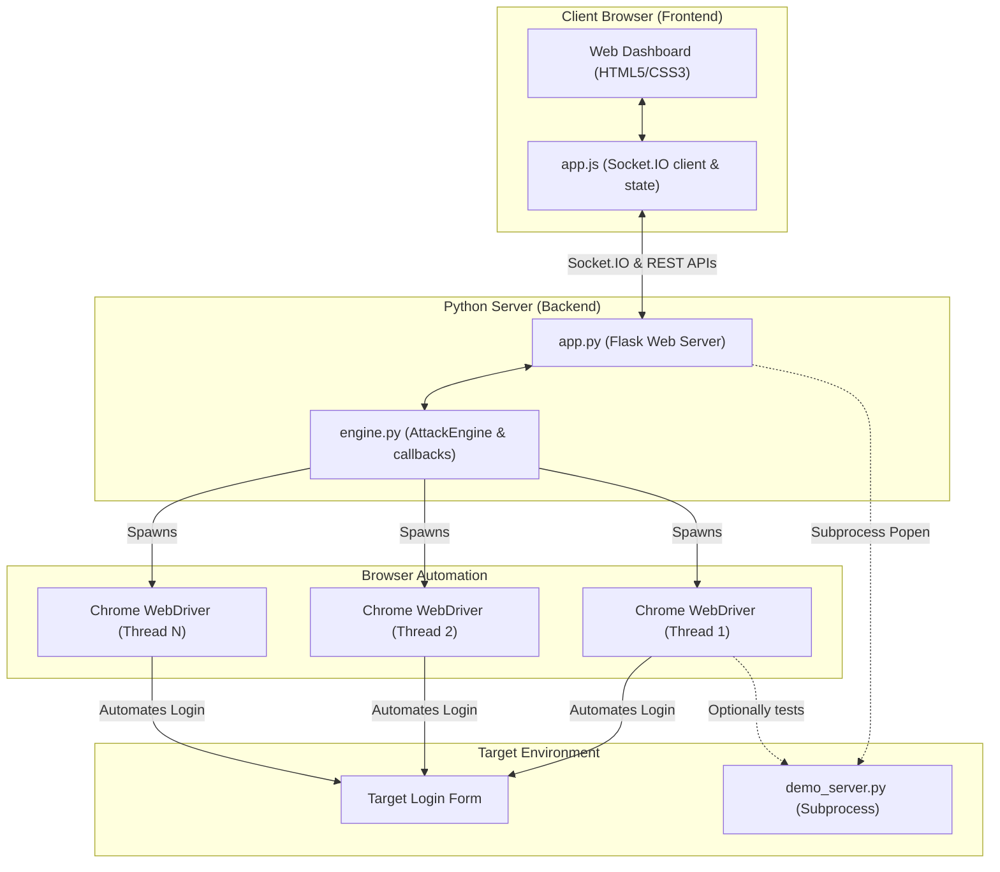
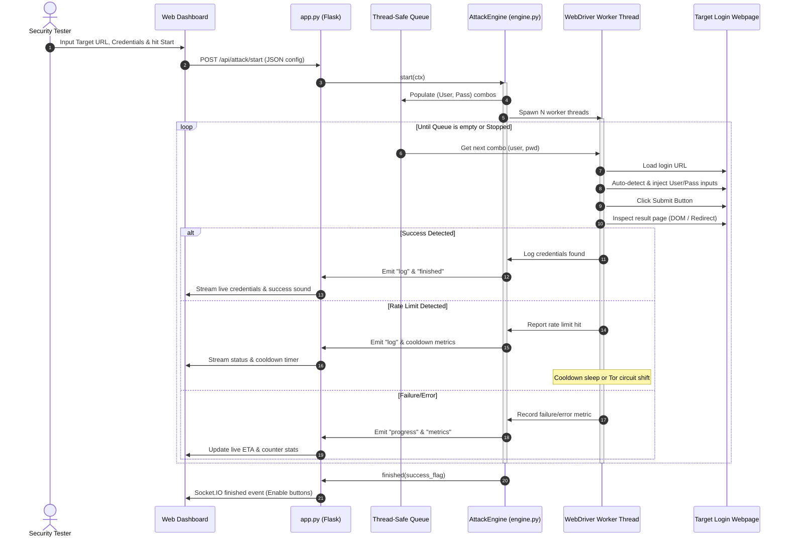

# BlueCrack

```
██████╗ ██╗     ██╗   ██╗███████╗  ██████╗██████╗  █████╗  ██████╗██╗  ██╗
██╔══██╗██║     ██║   ██║██╔════╝ ██╔════╝██╔══██╗██╔══██╗██╔════╝██║ ██╔╝
██████╔╝██║     ██║   ██║█████╗   ██║     ██████╔╝███████║██║     █████╔╝
██╔══██╗██║     ██║   ██║██╔══╝   ██║     ██╔══██╗██╔══██║██║     ██╔═██╗
██████╔╝███████╗╚██████╔╝███████╗ ╚██████╗██║  ██║██║  ██║╚██████╗██║  ██╗
╚═════╝ ╚══════╝ ╚═════╝ ╚══════╝  ╚═════╝╚═╝  ╚═╝╚═╝  ╚═╝ ╚═════╝╚═╝  ╚═╝
```


**BlueCrack** is an advanced, Hydra-style browser-based login tester powered by Selenium and Flask. By driving actual Google Chrome instances in parallel, BlueCrack automates credential auditing against complex authentication portals that traditional HTTP-based brute-forcers cannot handle. It is wrapped in a premium, ultra-responsive dark web console streaming real-time statistics and execution logs.

---

> ## ⚠️ Responsible Use Warning
>
> **BlueCrack is designed strictly for authorized security testing, educational research, and infrastructure auditing.** Unauthorized access to computer systems is illegal under international computer misuse laws (including the US CFAA and UK Computer Misuse Act). The developers assume **no liability** for misuse. Always obtain explicit written authorization before testing target environments.

---

## 🏗️ Architecture & Topology

Unlike simple script-based brute-forcers, BlueCrack implements a decoupled **Client-Server-Worker** model. The backend serves REST APIs and WebSockets to synchronize states, while thread-safe worker queues drive isolated automated browsers.

### System Topology Map

The diagram below illustrates the relationship between the client dashboard, the Flask server, the background attack engine, and the automation instances:



### Attack Execution Data Flow

This sequence chart outlines the step-by-step lifecycle of an active credential audit:



---

## 🎯 Features

### Core Capabilities
* **Full JavaScript Compatibility**: Handles React, Angular, Vue, and vanilla JS portals by rendering pages in full browser sessions.
* **Auto-Selector Engine**: Employs heuristic-based JS injection to automatically identify input fields for usernames, passwords, and submit buttons.
* **Tor Proxy & IP Shift**: Rotates IP addresses automatically using Tor circuits by communicating with the Tor Control Port.
* **Thread-Safe Concurrent Workers**: Run up to 50 concurrent headless or GUI browser instances with synchronized queue mechanisms.
* **Dynamic Rate-Limit Evasion**: Pause testing, add jitter, or cycle proxy gateways when encountering rate-limiting string triggers.
* **CUPP & Sequence Profilers**: Built-in credential profiling and sequential zero-padded range wordlist generators.

### Premium UI Enhancements
* **Lag-Free Logging**: Handles high-frequency console updates using `requestAnimationFrame` queue batching and `DocumentFragment` inserts to eliminate layout thrashing.
* **Cosmic Eco-Astral Theme**: Includes a stunning forest-green and celestial-purple space aesthetic toggle with persistent `LocalStorage` preferences.
* **Local Sandbox Mode**: Instantly launches a secure mock login server in the background and populates the dashboard for immediate training.

---

## 📁 Project Structure

```
BlueCrack/
├── app.py                 # Flask app + SocketIO WebSocket bridge
├── engine.py              # Core Selenium penetration engine & queue managers
├── bluecrack.py           # Multi-mode unified entry point (CLI/Web/Interactive)
├── demo_server.py         # Mock authentication server with CSRF & rate limit simulation
├── requirements.txt       # Unified project dependency manifests
├── LICENSE                # MIT Open Source License
├── cupp.py                # Profiling wordlist generator module
├── cupp.cfg               # Wordlist rules database
├── static/
│   ├── css/
│   │   └── style.css      # Custom stylesheet (Standard and Eco-Astral themes)
│   └── js/
│       └── app.js         # SocketIO integration & UI event loop controls
└── templates/
    └── index.html         # Glassmorphism HTML dashboard template
```

---

## 🛠️ Installation

### 1. Prerequisites
Ensure you have the following components installed:
* **Python 3.10+**
* **Google Chrome Browser**
* **ChromeDriver** (Selenium 4+ handles automatic driver management, but local installation works too)

### 2. Setup Codebase
Clone the repository and install all dependencies:
```bash
git clone https://github.com/taezeem14/BlueCrack.git
cd BlueCrack
pip install -r requirements.txt
```

### 3. Optional: Tor Configuration
To enable Tor IP rotation:
1. Install Tor: `sudo apt install tor` (Linux) or `brew install tor` (macOS).
2. Edit your `/etc/tor/torrc` (or local config) to enable the control port:
   ```text
   ControlPort 9051
   CookieAuthentication 0
   ```
3. Restart the Tor service.

---

## ▶️ Usage Modes

BlueCrack offers three operating interfaces: Web UI, command-line flags, and an interactive CLI setup wizard.

### 1. 🌐 Web UI Mode (Recommended)
Launch the graphical dashboard:
```bash
python bluecrack.py
```
This serves the application locally. Navigate to `http://127.0.0.1:5000` to configure settings, generate passwords via CUPP, choose custom themes, or spin up the sandbox.

To run it exposed on your local network (e.g., to access from a tablet):
```bash
python bluecrack.py --web --host 0.0.0.0 --port 8080
```

### 2. ⌨️ CLI Mode
Execute high-speed brute forcing directly in your terminal:
```bash
# Basic single login test
python bluecrack.py -u admin -p admin123 --url http://target.local/login --error "wrong password"

# Multi-threaded dictionary attack with Tor proxying
python bluecrack.py -U users.txt -P rockyou.txt --url http://target.local/login \
    --success "Welcome" --threads 4 --headless --proxy socks5://127.0.0.1:9050
```

### 3. 🧙 Interactive Wizard Mode
For guided CLI setup, walk through settings step-by-step:
```bash
python bluecrack.py -i
```

---

## ⚙️ CLI Flag Reference

| Flag | Parameter | Description |
|---|---|---|
| `-u`, `--user` | `TEXT` | Single target username |
| `-U`, `--userfile` | `FILE` | File containing list of usernames |
| `-p`, `--passw` | `TEXT` | Single password to test |
| `-P`, `--passlist` | `FILE` | File containing list of passwords |
| `--url` | `URL` | Web URL containing target login form |
| `--error` | `TEXT` | Substring on page indicating login failure |
| `--success` | `TEXT` | Substring on page indicating login success |
| `--threads` | `INT` | Parallel browser workers (default: 1) |
| `--headless` | `FLAG` | Runs browser without rendering UI windows |
| `--delay` | `FLOAT` | Throttling time delay in seconds |
| `--jitter` | `FLOAT` | Randomized variance added to the delay |
| `--limit-text` | `TEXT` | Substring indicating rate limits |
| `--cooldown` | `INT` | Wait time in seconds when rate limited |
| `--proxy` | `URL` | Single SOCKS/HTTP proxy server url |
| `--proxy-list` | `FILE` | File containing multiple proxy IPs |
| `--output` | `FILE` | Saves found credentials to output file |
| `--json-report` | `FLAG` | Exports full execution run history to JSON |

---

## 🧪 Local Sandbox Testing
To practice or demonstrate credential testing safely without hitting live servers:
1. Open the Web UI (`http://127.0.0.1:5000`).
2. Click **`🚀 Demo Mode`** at the top right.
3. The server will spin up `demo_server.py` in the background and auto-populate all target URLs and fields.
4. Click **`▶ Start Attack`** to watch the worker threads execute live!

---

## 📄 License

This project is licensed under the **MIT License** — see the [LICENSE](LICENSE) file for details.

```
MIT License

Copyright (c) 2025–2026 Muhammad Taezeem Tariq

Permission is hereby granted, free of charge, to any person obtaining a copy
of this software and associated documentation files (the "Software"), to deal
in the Software without restriction, including without limitation the rights
to use, copy, modify, merge, publish, distribute, sublicense, and/or sell
copies of the Software, and to permit persons to whom the Software is
furnished to do so, subject to the following conditions:

The above copyright notice and this permission notice shall be included in all
copies or substantial portions of the Software.

THE SOFTWARE IS PROVIDED "AS IS", WITHOUT WARRANTY OF ANY KIND, EXPRESS OR
IMPLIED, INCLUDING BUT NOT LIMITED TO THE WARRANTIES OF MERCHANTABILITY,
FITNESS FOR A PARTICULAR PURPOSE AND NONINFRINGEMENT. IN NO EVENT SHALL THE
AUTHORS OR COPYRIGHT HOLDERS BE LIABLE FOR ANY CLAIM, DAMAGES OR OTHER
LIABILITY, WHETHER IN AN ACTION OF CONTRACT, TORT OR OTHERWISE, ARISING FROM,
OUT OF OR IN CONNECTION WITH THE SOFTWARE OR THE USE OR OTHER DEALINGS IN THE
SOFTWARE.
```

---

## 👤 Author

**Muhammad Taezeem Tariq**

---

<p align="center">
  <sub>Built with ❤️ for the security research community</sub>
</p>
