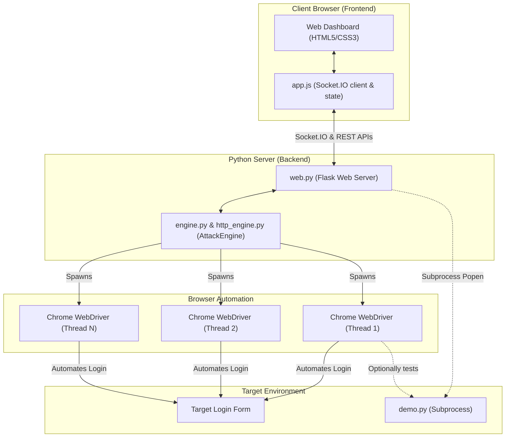
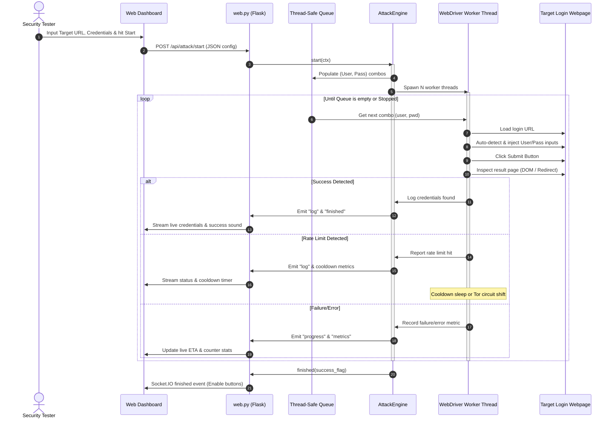

# BlueCrack

```
██████╗ ██╗     ██╗   ██╗███████╗  ██████╗██████╗  █████╗  ██████╗██╗  ██╗
██╔══██╗██║     ██║   ██║██╔════╝ ██╔════╝██╔══██╗██╔══██╗██╔════╝██║ ██╔╝
██████╔╝██║     ██║   ██║█████╗   ██║     ██████╔╝███████║██║     █████╔╝
██╔══██╗██║     ██║   ██║██╔══╝   ██║     ██╔══██╗██╔══██║██║     ██╔═██╗
██████╔╝███████╗╚██████╔╝███████╗ ╚██████╗██║  ██║██║  ██║╚██████╗██║  ██╗
╚═════╝ ╚══════╝ ╚═════╝ ╚══════╝  ╚═════╝╚═╝  ╚═╝╚═╝  ╚═╝ ╚═════╝╚═╝  ╚═╝
```

[](https://pypi.org/project/bluecrack/)
[](https://pypi.org/project/bluecrack/)
[](https://pypi.org/project/bluecrack/)
[](https://github.com/taezeem14/BlueCrack/blob/main/LICENSE)
[](https://github.com/taezeem14/BlueCrack/actions/workflows/publish.yml)


**BlueCrack** is an advanced, Hydra-style browser-based login tester powered by Selenium and Flask. By driving actual Google Chrome instances in parallel, BlueCrack automates credential auditing against complex authentication portals that traditional HTTP-based brute-forcers cannot handle. It is wrapped in a premium, ultra-responsive dark web console streaming real-time statistics and execution logs.

---

> ## ⚠️ Responsible Use Warning
>
> **BlueCrack is designed strictly for authorized security testing, educational research, and infrastructure auditing.** Unauthorized access to computer systems is illegal under international computer misuse laws (including the US CFAA and UK Computer Misuse Act). The developers assume **no liability** for misuse. Always obtain explicit written authorization before testing target environments.

---

## 🏗️ Architecture & Topology

Unlike simple script-based brute-forcers, BlueCrack implements a decoupled **Client-Server-Worker** model. The backend serves REST APIs and WebSockets to synchronize states, while thread-safe worker queues drive isolated automated browsers.

### System Topology Map

The diagram below illustrates the relationship between the client dashboard, the Flask server, the background attack engine, and the automation instances:



### Attack Execution Data Flow

This sequence chart outlines the step-by-step lifecycle of an active credential audit:



---

## 🎯 Features

### Core Capabilities
* **Dual Attack Modes**:
  * **Browser Mode** (Selenium): Runs real Google Chrome instances in parallel. Ideal for JS-heavy, React, Angular, Vue, and SPA login portals.
  * **HTTP Mode** (Hydra-style): Executes raw, high-performance HTTP POST requests. Bypasses browser rendering entirely. Ideal for simple HTML forms, running **100x–500x faster**.
* **Auto-Selector / Field Detection**: Employs heuristic-based parsing to automatically identify input fields, username/password names, hidden elements (CSRF tokens), and submit handlers.
* **Browser Instance Reuse**: Optimized Selenium worker threads clear cookies (`delete_all_cookies()`) between runs rather than restarting the Chrome process, cutting CPU/RAM overhead by 90%.
* **Tor Proxy & IP Shift**: Rotates IP addresses automatically using Tor circuits by communicating with the Tor Control Port.
* **Thread-Safe Concurrent Workers**: Run up to 50 concurrent browser or connection workers with synchronized thread-safe queue mechanisms.
* **Dynamic Rate-Limit Evasion**: Pause testing, add jitter, or cycle proxy gateways when encountering rate-limiting string triggers.
* **CUPP & Sequence Profilers**: Built-in credential profiling and sequential zero-padded range wordlist generators.

### Premium UI Enhancements
* **Lag-Free Logging**: Handles high-frequency console updates using `requestAnimationFrame` queue batching and `DocumentFragment` inserts to eliminate layout thrashing.
* **Cosmic Eco-Astral Theme**: Includes a stunning forest-green and celestial-purple space aesthetic toggle with persistent `LocalStorage` preferences.
* **Local Sandbox Mode**: Instantly launches a secure mock login server in the background and populates the dashboard for immediate training.

---

## 📁 Project Structure

```
BlueCrack/
├── pyproject.toml         # PEP 621 metadata & entry point definitions
├── MANIFEST.in            # Bundles static web templates & configuration data
├── LICENSE                # MIT Open Source License
├── requirements.txt       # Unified project dependency manifests
│
├── src/
│   └── bluecrack/         # Source code package
│       ├── __init__.py    # Version and API initialization
│       ├── __main__.py    # Entry point for python -m bluecrack
│       ├── cli.py         # Subcommand dispatcher
│       ├── web.py         # Flask Web UI & SocketIO bridge
│       ├── engine.py      # Core Selenium AttackEngine
│       ├── http_engine.py # Core raw HTTP AttackEngine (Hydra-style)
│       ├── attack.py      # CLI brute-force execution flow
│       ├── demo.py        # Sandbox authentication server
│       ├── doctor.py      # System diagnostic check utility
│       ├── constants.py   # Shared scripts & ANSI styling
│       ├── utils.py       # Tor rotation, chromedriver & wordlist generation
│       │
│       ├── data/          # Embedded package configuration
│       │   ├── cupp.cfg   # Wordlist rules database
│       │   └── pass.txt   # Demo password list
│       │
│       ├── templates/     # Web templates
│       │   └── index.html # Glassmorphism dashboard
│       │
│       └── static/        # Static stylesheets & JS
│           ├── css/style.css
│           └── js/app.js
```

---

## 🛠️ Installation

### 1. From PyPI (Recommended)
You can install BlueCrack directly as an executable package:
```bash
pip install bluecrack
```

### 2. From Source (Development Mode)
Clone the repository and install it in editable mode:
```bash
git clone https://github.com/taezeem14/BlueCrack.git
cd BlueCrack
pip install -e .
```

### 3. Optional Features
Install extras for Tor circuit rotation and keyboard selector:
```bash
pip install bluecrack[tor]       # Tor IP rotation (stem)
pip install bluecrack[keyboard]  # Manual CSS selector mode
pip install bluecrack[all]       # Everything
```

### 4. Prerequisites
* **Python 3.10+**
* **Google Chrome Browser** (required for `browser` mode; optional for `http` mode)
* **ChromeDriver** (Selenium Manager automatically fetches the correct version for you)

---

## ▶️ Usage Subcommands

After installation, the unified `bluecrack` binary is added to your terminal PATH.

### 1. 🌐 Web UI (Default)
Launch the graphical dashboard:
```bash
bluecrack
# or explicitly
bluecrack web --port 5000
# Listen on all interfaces with debug mode
bluecrack web --host 0.0.0.0 --port 8080 --debug
```
Navigate to `http://127.0.0.1:5000` in your web browser. Select **HTTP Mode** or **Browser Mode** directly from the settings panel.

### 2. ⌨️ CLI Attack Mode
Run dictionary attacks directly inside the terminal:
```bash
# Basic single login test (Default: Browser Mode)
bluecrack attack -u admin -p admin123 --url http://target.local/login --error "wrong password"

# Multi-threaded dictionary attack (HTTP Mode - Lightning Fast)
bluecrack attack --mode http -U users.txt -P rockyou.txt --url http://target.local/login \
    --error "invalid" --threads 10
```

### 3. 🧙 Interactive Wizard Mode
Let the wizard prompt you for configuration details, including mode selection:
```bash
bluecrack attack -i
```

### 4. 🧪 Local Sandbox
Launch the demo login server on an isolated port:
```bash
bluecrack demo --port 5001 --max-attempts 3
```

### 5. 🩺 Doctor Diagnostic Tool
Check system dependencies, browser version, and chromedriver availability:
```bash
bluecrack doctor
```

### 6. 🔌 Plugin CLI Utilities
Generate sequences or run CUPP interactively:
```bash
bluecrack plugin cupp
bluecrack plugin sequence --start 1000 --end 9999 --output sequence.txt
```

---

## ⚙️ CLI Flag Reference (`bluecrack attack`)

| Flag | Parameter | Description |
|---|---|---|
| `--mode` | `browser` / `http` | Attack mode: `browser` (Selenium) or `http` (raw HTTP POST) (default: `browser`) |
| `-u`, `--user` | `TEXT` | Single target username |
| `-U`, `--userfile` | `FILE` | File containing list of usernames |
| `-p`, `--passw` | `TEXT` | Single password to test |
| `-P`, `--passlist` | `FILE` | File containing list of passwords |
| `--url` | `URL` | Web URL containing target login form |
| `--error` | `TEXT` | Substring on page indicating login failure |
| `--success` | `TEXT` | Substring on page indicating login success |
| `--threads` | `INT` | Parallel browser/connection workers (default: 1) |
| `--headless` | `FLAG` | Runs browser without rendering UI windows (browser mode only) |
| `--delay` | `FLOAT` | Throttling time delay in seconds |
| `--jitter` | `FLOAT` | Randomized variance added to the delay |
| `--limit-text` | `TEXT` | Substring indicating rate limits |
| `--cooldown` | `INT` | Wait time in seconds when rate limited |
| `--proxy` | `URL` | Single SOCKS/HTTP proxy server url |
| `--proxy-list` | `FILE` | File containing multiple proxy IPs |
| `--output` | `FILE` | Saves found credentials to output file |
| `--json-report` | `FLAG` | Exports full execution run history to JSON |
| `--form-action` | `URL` | Custom HTTP POST target URL endpoint (http mode; auto-detected if blank) |
| `--username-field` | `TEXT` | Custom input field name for usernames (http mode; auto-detected if blank) |
| `--password-field` | `TEXT` | Custom input field name for passwords (http mode; auto-detected if blank) |
| `--csrf-field` | `TEXT` | Custom token field name for anti-CSRF extraction (http mode; auto-detected if blank) |
| `--extra-fields` | `TEXT` | Extra post fields as comma-separated `key=val` pairs (http mode) |
| `--follow-redirects`| `FLAG` | Follow HTTP redirects on form submission (http mode) |
| `-i`, `--interactive` | `FLAG` | Launch the interactive setup wizard |
| `--max-attempts` | `INT` | Maximum total attempts before stopping (0 = unlimited, default: 0) |
| `--continue-after-success` | `FLAG` | Continue testing remaining credentials after a successful login |

---

## 🧪 Local Sandbox Testing
To practice or demonstrate credential testing safely without hitting live servers:
1. Open the Web UI (`bluecrack`).
2. Click **`🚀 Demo Mode`** at the top right.
3. The server will spin up `bluecrack demo` in the background and auto-populate all target URLs and fields.
4. Click **`▶ Start Attack`** to watch the worker threads execute live!

---

## 🤝 Contributing

Contributions are welcome! Please:
1. Fork the repository
2. Create a feature branch (`git checkout -b feature/amazing-feature`)
3. Commit your changes (`git commit -m 'Add amazing feature'`)
4. Push to the branch (`git push origin feature/amazing-feature`)
5. Open a Pull Request

For development setup:
```bash
pip install -e ".[dev]"
ruff check src/
python -m pytest
```

---

## 📋 Changelog

### v3.2.0
* Fixed critical `doctor` command crash when selenium is not installed
* Fixed CVE-2024-35195 by bumping `requests` minimum to ≥2.32
* Fixed Windows encoding crash when reading CUPP wordlists
* Updated Chrome user agent strings to v131
* Bumped minimum Python version to 3.10 (3.9 reached EOL)
* Bumped all dependency minimum versions
* Added `--max-attempts`, `--continue-after-success`, `-i` to CLI docs
* Added optional dependency installation instructions
* Fixed `os.system()` path-with-spaces bug in CLI plugin runner
* Improved error reporting in JSON report saving

### v3.1.4
* Raw HTTP attack mode (Hydra-style)
* Demo login server with CSRF, rate limiting, and multi-account support
* Doctor diagnostic command
* PyPI package restructuring

---

## ❓ FAQ

**Q: Do I need Chrome for HTTP mode?**
A: No. HTTP mode uses raw `requests` and does not require Chrome or Selenium.

**Q: `bluecrack doctor` crashes with ModuleNotFoundError?**
A: Update to v3.2.0+ where this is fixed. Run `pip install -U bluecrack`.

**Q: Dependencies not installed with `pip install bluecrack`?**
A: Clear your pip cache and reinstall: `pip install --no-cache-dir -U bluecrack`.

---


## 📄 License

This project is licensed under the **MIT License** — see the [LICENSE](LICENSE) file for details.

```
MIT License

Copyright (c) 2025–2026 Muhammad Taezeem Tariq

Permission is hereby granted, free of charge, to any person obtaining a copy
of this software and associated documentation files (the "Software"), to deal
in the Software without restriction, including without limitation the rights
to use, copy, modify, merge, publish, distribute, sublicense, and/or sell
copies of the Software, and to permit persons to whom the Software is
furnished to do so, subject to the following conditions:

The above copyright notice and this permission notice shall be included in all
copies or substantial portions of the Software.

THE SOFTWARE IS PROVIDED "AS IS", WITHOUT WARRANTY OF ANY KIND, EXPRESS OR
IMPLIED, INCLUDING BUT NOT LIMITED TO THE WARRANTIES OF MERCHANTABILITY,
FITNESS FOR A PARTICULAR PURPOSE AND NONINFRINGEMENT. IN NO EVENT SHALL THE
AUTHORS OR COPYRIGHT HOLDERS BE LIABLE FOR ANY CLAIM, DAMAGES OR OTHER
LIABILITY, WHETHER IN AN ACTION OF CONTRACT, TORT OR OTHERWISE, ARISING FROM,
OUT OF OR IN CONNECTION WITH THE SOFTWARE OR THE USE OR OTHER DEALINGS IN THE
SOFTWARE.
```

---

## 👤 Author

**Muhammad Taezeem Tariq**

---

<p align="center">
  <sub>Built with ❤️ for the security research community</sub>
</p>
