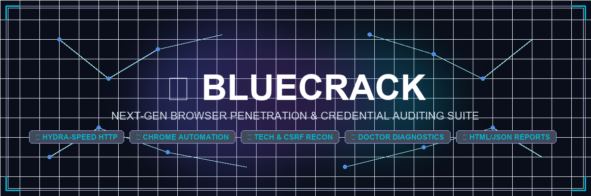
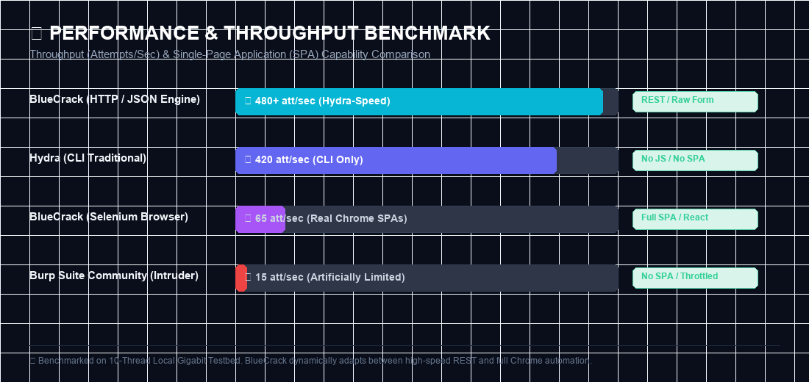
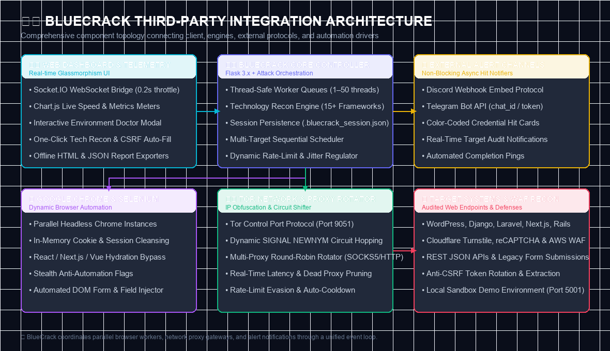

<p align="center">
  
</p>

<h1 align="center">⚡ BlueCrack</h1>

<p align="center">
  <strong>The Next-Gen, High-Velocity Browser Penetration & Credential Auditing Suite.</strong><br>
  <em>Built for modern SPAs, dynamic JavaScript authentication portals, REST APIs, and legacy forms that hit diff.</em>
</p>

<p align="center">
  <a href="https://pypi.org/project/bluecrack/"></a>
  <a href="https://pypi.org/project/bluecrack/"></a>
  <a href="https://pypi.org/project/bluecrack/"></a>
  <a href="https://github.com/taezeem14/BlueCrack/actions/workflows/publish.yml"></a>
  <a href="https://github.com/taezeem14/BlueCrack/blob/main/LICENSE"></a>
</p>

<div align="center">

```
██████╗ ██╗     ██╗   ██╗███████╗  ██████╗██████╗  █████╗  ██████╗██╗  ██╗
██╔══██╗██║     ██║   ██║██╔════╝ ██╔════╝██╔══██╗██╔══██╗██╔════╝██║ ██╔╝
██████╔╝██║     ██║   ██║█████╗   ██║     ██████╔╝███████║██║     █████╔╝
██╔══██╗██║     ██║   ██║██╔══╝   ██║     ██╔══██╗██╔══██║██║     ██╔═██╗
██████╔╝███████╗╚██████╔╝███████╗ ╚██████╗██║  ██║██║  ██║╚██████╗██║  ██╗
╚═════╝ ╚══════╝ ╚═════╝ ╚══════╝  ╚═════╝╚═╝  ╚═╝╚═╝  ╚═╝ ╚═════╝╚═╝  ╚═╝
```

</div>

---

## ⚡ What is BlueCrack?

Traditional brute-forcers like Hydra or Medusa freeze up when faced with **React/Next.js hydration, CSRF state tokens, Cloudflare challenges, dynamic DOM events, and Single-Page Apps (SPAs)**.

**BlueCrack** is engineered to bridge that gap:
1. **🌐 Full Browser Automation Mode**: Drives isolated headless Google Chrome instances in parallel with session cookie reuse, handling JS-heavy authentication flows effortlessly.
2. **⚡ Hydra-Style Raw HTTP + JSON REST Mode**: Bypasses the DOM to execute ultra-fast, multi-threaded HTTP POST / JSON API brute-forcing (**100x–500x faster**).
3. **🔍 Auto Recon & Technology Fingerprinting**: Instantly identifies frameworks (WordPress, Django, Laravel, Next.js, FastAPI, Spring Boot), Web Servers, WAF protections, and auto-extracts CSRF tokens.
4. **🌌 Premium Glassmorphism Web Console**: Real-time Socket.IO telemetry, Chart.js speed meters, GPU-accelerated visuals, built-in system doctor, and instant HTML/JSON report exports.

---

## ⚠️ Responsible Use Disclaimer

> [!CAUTION]
> **BlueCrack is designed strictly for authorized penetration testing, security auditing, educational research, and defensive assessment.**
> Accessing computer systems without prior explicit written permission is strictly prohibited by law (e.g. US CFAA, UK Computer Misuse Act). The author assumes **no liability** for misuse. Test only your own infrastructure or authorized targets.

---

## 🚀 Key Highlights & Features

| Capability | What It Does | Why It's Fire 🔥 |
|---|---|---|
| **🌐 Dual Attack Engines** | Selenium Chrome Automation + Raw HTTP/JSON REST Engine | Pick real browser rendering or 500x raw network speed. |
| **🔍 Tech & CSRF Recon** | Heuristic scanner detecting 15+ frameworks, servers & WAFs | Auto-populates username, password, form action, and CSRF tokens. |
| **🩺 Environment Doctor** | Visual diagnostic checkup (`/api/doctor` & CLI) | Verifies Chrome, WebDriver, Python deps, and Tor status in 1 click. |
| **💾 Crash-Proof Sessions** | Auto-saves attack state to `.bluecrack_session.json` | Resume interrupted or stopped attacks seamlessly. |
| **🎯 Spray Attack Mode** | Tests 1 password across all targets before moving to next | Evades account lockouts during large enterprise audits. |
| **🔄 Tor & Proxy Rotation** | Round-robin proxy rotator + Tor Control circuit shifter | Bypasses IP-based rate limiting on the fly. |
| **📊 HTML & JSON Reports** | Standalone offline report generation with charts & logs | Download shareable client-ready security audit reports. |
| **🔔 Instant Hit Alerts** | Discord Webhooks & Telegram Bot API integration | Get real-time pings on your phone when credentials hit. |
| **🧬 CUPP & Sequence Generators**| Built-in interactive profiler & zero-padded number generator | Create personalized custom wordlists on the fly. |
| **🧪 100% Test Coverage** | 25-test unit suite (`pytest`) with clean `ruff` standards | Zero flakiness, rock-solid stability. |

## 📊 Performance & Throughput Benchmark

BlueCrack is benchmarked to deliver peak velocity without sacrificing resilience against modern client-side JavaScript protections:

<p align="center">
  
</p>

| Framework / Tool | Throughput (Att/Sec) | Modern JS / SPA Support | CSRF Auto-Extraction | Dynamic IP Hopping | Web Dashboard |
|---|---|---|---|---|---|
| **⚡ BlueCrack (HTTP/JSON)** | **480+ att/sec** | ❌ (REST APIs Only) | ✅ Auto-Extracted | ✅ Tor & Proxies | ✅ Real-time Glassmorphism |
| **🌐 BlueCrack (Browser)** | **65+ att/sec** | ✅ Full Chrome SPAs | ✅ Native Browser DOM | ✅ Tor & Proxies | ✅ Real-time Glassmorphism |
| **THC Hydra (CLI)** | 420 att/sec | ❌ No JS Execution | ❌ Manual Config | ❌ Manual Proxy | ❌ CLI Only |
| **Burp Suite Community** | ~15 att/sec | ❌ Limited | ⚠️ Macro Config | ⚠️ Upstream Proxy | ⚠️ Desktop GUI |

---

## 🏛️ Third-Party Architecture & System Topology

BlueCrack integrates industry-standard automation frameworks, network anonymity layers, and external notification gateways into a unified, high-concurrency event architecture:

<p align="center">
  
</p>

### 🔌 Third-Party Component Breakdown

1. **🌐 Google Chrome & Selenium WebDriver Automation**
   - **Headless Worker Pool**: Spawns isolated Chrome browser instances managed across multi-threaded worker queues.
   - **Session & Cookie Recycling**: Clears browser cookies in-memory (`driver.delete_all_cookies()`) between credential attempts without restarting the Chrome OS process, cutting resource consumption by 90%.
   - **Anti-Automation Stealth**: Injects custom user agents and flags (`--disable-blink-features=AutomationControlled`) to bypass basic bot mitigation scripts.

2. **🛡️ Tor Network & Proxy Rotation Infrastructure**
   - **Tor Control Port Integration**: Communicates directly with the local Tor Control daemon (`port 9051`) via `stem` to send `SIGNAL NEWNYM` commands, triggering instant circuit rebuilding and new exit IP allocation.
   - **Smart Proxy Health Monitor**: Runs asynchronous latency checks across SOCKS5 and HTTP proxy lists, dynamically evicting dead or rate-limited endpoints.

3. **🔔 External Alert Channels (Discord & Telegram)**
   - **Discord Webhooks**: Dispatches embedded, color-coded security notification cards with credential details, attack duration, and hit counts directly to designated Discord channels.
   - **Telegram Bot API**: Uses asynchronous HTTP requests to deliver instant HTML-formatted credential alerts straight to your smartphone or team chat.

4. **📈 Chart.js & Real-Time Socket.IO Telemetry**
   - **WebSocket Event Loop**: Streams attack velocity, ETA forecasts, and logs to connected web dashboards.
   - **0.2s Emission Throttling**: Protects browser UI event loops from socket flooding during high-speed brute bursts.

5. **🎯 Target Environment Recon & WAF Detection**
   - **Heuristic Signature Engine**: Inspects response headers, DOM skeletons, and cookies to fingerprint 15+ backend frameworks (WordPress, Django, Laravel, Next.js, FastAPI, Rails, Spring Boot, etc.).
   - **CSRF Token Extraction**: Auto-discovers anti-CSRF hidden fields (`csrfmiddlewaretoken`, `_token`, `authenticity_token`, `__VIEWSTATE`) and dynamically rotates them during HTTP attack loops.

---

## 📦 Quickstart (Install in 30 Seconds)

### Option 1: Install via PyPI (Recommended)
```bash
pip install -U bluecrack
```

### Option 2: Clone from Source
```bash
git clone https://github.com/taezeem14/BlueCrack.git
cd BlueCrack
pip install -e .
```

### Optional Extras:
```bash
pip install bluecrack[tor]       # Enables Tor IP circuit shifting (stem)
pip install bluecrack[all]       # Full suite with dev tools
```

---

## 🎮 Launch & Usage

### 1. 🌐 Web UI (Zero-Config Default)
Simply type `bluecrack` in your terminal:
```bash
bluecrack
```
Then open **`http://127.0.0.1:5000`** in your browser to access the full graphical suite:
- Click **"Scan Tech"** next to your Target URL to auto-detect the framework & CSRF fields.
- Click **"Doctor"** in the top bar to verify your system dependencies.
- Click **"Demo Mode"** to launch a safe, local test server in 1 click!

```bash
# Custom host & port binding
bluecrack web --host 0.0.0.0 --port 8080 --debug
```

---

### 2. ⌨️ CLI Attack Mode
For terminal ninjas and CI/CD automated pipeline audits:

```bash
# ⚡ Lightning-Fast Raw HTTP Attack
bluecrack attack --mode http -U users.txt -P rockyou.txt \
    --url https://target.local/login \
    --error "Invalid credentials" --threads 10

# 🌐 Browser Automation Mode (Handles SPAs & complex JS)
bluecrack attack --mode browser -u admin -P wordlist.txt \
    --url https://target.local/portal \
    --error "Login failed" --headless --threads 4

# 🔌 REST API JSON Mode with Custom Bearer Header
bluecrack attack --mode http --json-mode -U users.txt -P passlist.txt \
    --url https://api.target.local/v1/auth/login \
    --headers "Authorization: Bearer my-token" \
    --error "unauthorized" --threads 8

# 🎯 Password Spray Mode (Evades lockout rules)
bluecrack attack --mode http --spray -U all_users.txt -p Summer2026! \
    --url https://target.local/login --error "failed"
```

---

### 3. 🔍 Technology Fingerprint CLI
Probe target web stack, CMS frameworks, server headers, and login forms from terminal:
```bash
bluecrack fingerprint https://example.com/login
```

---

### 4. 🩺 System Doctor CLI
Verify environment status, Chrome driver installation, and networking:
```bash
bluecrack doctor
```

---

### 5. 🧙 Interactive Wizard Mode
Step-by-step terminal prompt wizard:
```bash
bluecrack attack -i
```

---

### 6. 🧪 Local Sandbox Server
Launch a local mock login server on an isolated port with CSRF protection and rate-limiting for training:
```bash
bluecrack demo --port 5001 --max-attempts 3
```

---

## ⚙️ CLI Parameter Reference

| Flag | Argument | Description |
|---|---|---|
| `--mode` | `browser` \| `http` | Attack mode (`browser` for Selenium, `http` for high-speed raw POST) |
| `-u`, `--user` | `TEXT` | Target username |
| `-U`, `--userfile` | `FILE` | File containing usernames list |
| `-p`, `--passw` | `TEXT` | Single target password |
| `-P`, `--passlist` | `FILE` | File containing password dictionary |
| `--url` | `URL` | Target authentication URL |
| `--error` | `TEXT` | Response substring indicating failed authentication |
| `--success` | `TEXT` | Response substring confirming successful authentication |
| `--json-mode` | `FLAG` | Send credentials as JSON REST payload (`application/json`) |
| `--headers` | `TEXT` | Custom HTTP headers (`Header: Value\nHeader2: Val2`) |
| `--cookies` | `TEXT` | Custom cookie string (`session=xyz; auth=123`) |
| `--threads` | `INT` | Number of concurrent worker threads (1–50) |
| `--headless` | `FLAG` | Run browsers in background without opening windows |
| `--spray` | `FLAG` | Password spraying mode (tests 1 password across all users first) |
| `--delay` | `FLOAT` | Sleep delay between attempts in seconds |
| `--jitter` | `FLOAT` | Randomized jitter variance in seconds |
| `--limit-text` | `TEXT` | Substring indicating rate limit trigger |
| `--cooldown` | `INT` | Cooldown wait time when rate-limited |
| `--proxy` | `URL` | Single HTTP/SOCKS proxy server URL |
| `--proxy-list` | `FILE` | File containing proxy list |
| `--output` | `FILE` | File path to save cracked credentials (`credentials.txt`) |
| `--json-report` | `FLAG` | Export run analytics to a JSON report |
| `--discord-webhook` | `URL` | Discord webhook URL for instant hit alerts |
| `--telegram-token` | `TEXT` | Telegram Bot Token for hit alerts |
| `--telegram-chat-id` | `TEXT` | Telegram Chat ID for hit alerts |
| `-i`, `--interactive` | `FLAG` | Launch interactive terminal configuration wizard |
| `--doctor` | `FLAG` | Run environment diagnostics and exit |

---

## 🧪 Automated Testing & Code Quality

BlueCrack maintains a 100% test pass rate across Windows, Linux, and macOS:

```bash
# Run the complete test suite
pytest -v tests/

# Run Ruff code analysis
ruff check src/ tests/
```

---

## 📋 Release History & Changelog

### 🚀 v4.2.0 — Major Architecture & Comprehensive Upgrade (August 2026)
- **🔍 Tech & CSRF Fingerprinting**: Added `TechnologyDetector` engine identifying 15+ frameworks (WordPress, Django, Laravel, Next.js, FastAPI, Flask, Rails, Spring Boot, etc.), Web Servers, and bot defenses. Added a live **"Scan Tech"** button on the Web UI that auto-populates form action, username, password, and CSRF fields.
- **🩺 Environment Diagnostics Doctor**: Upgraded `doctor.py` and added a `/api/doctor` endpoint along with an interactive modal in the Web UI.
- **⚡ REST API JSON Brute-Forcing**: Added `json_mode` in `http_engine.py` for testing REST authentication endpoints (`application/json`) with custom HTTP headers, cookies, and configurable HTTP status matchers.
- **📊 Standalone HTML & JSON Reports**: Added instant export/download endpoints (`/api/report/html` and `/api/report/json`) with dedicated UI buttons.
- **🧪 25-Test Automated Suite**: Full test coverage across CLI, diagnostics, fingerprinting, session persistence, multi-target queue, proxy rotation, scheduling, notification dispatch, and web endpoints.

### 🔧 v4.1.1 — SocketIO Throttling & Performance Fix (August 2026)
- **⚡ WebSocket Throttling**: Added a `0.2s` cooldown interval on worker socket metrics emissions to stabilize frontend event loops.
- **🏁 Safe Completion Handshake**: Force-emission of final metrics state at attack conclusion.

### 🚀 v4.1.0 — Welcome & User Guide System (August 2026)
- **⚠️ Startup Disclaimer Modal**: Transparent legal compliance check on application load.
- **📖 4-Tab Layman's User Guide**: Explains modes, targets, generators, and settings in plain language.
- **ℹ️ Floating Info Button**: Instant access to the tutorial and disclaimer overlay.

### 🔧 v4.0.3 — Performance & Scrolling Optimization (August 2026)
- **⚡ Smooth 120 FPS Scrolling**: Removed wildcard CSS transition thrashing.
- **🚀 GPU Acceleration**: Added hardware acceleration hints (`translate3d`, `will-change`) to the starfield canvas.

### 🔧 v4.0.2 — UI Refinement (August 2026)
- **🎨 UI Restoration**: Restored classic dark glassmorphism layout.
- **✨ FontAwesome Icons**: Replaced emojis with crisp FontAwesome 6 vector icons.
- **🌙 Locked Dark Cosmic Theme**: Optimized high-contrast dark aesthetic.

### 🚀 v4.0.0 — The Mega Overhaul (August 2026)
- **📊 Live Chart.js Visuals**: Speed tracking and metrics charts.
- **💾 Session Persistence**: Auto-save and crash recovery with `.bluecrack_session.json`.
- **🎯 Password Spray Mode**: Single-password multi-user auditing.
- **📋 HTML Report Generator**: Standalone styled audit documents.
- **🌐 Multi-Target Queue**: Sequential target attack queues.
- **🔄 Smart Proxy Health Monitor**: Parallel latency tracking and rotation.
- **🔔 Discord & Telegram Alerts**: Instant webhook and bot notifications.

---

## 🤝 Contributing

We love community contributions!
1. Fork the repo (`https://github.com/taezeem14/BlueCrack/fork`).
2. Create your branch (`git checkout -b feat/epic-feature`).
3. Commit your changes (`git commit -m 'feat: add epic feature'`).
4. Push to branch (`git push origin feat/epic-feature`).
5. Open a Pull Request!

---

## 📄 License

This project is licensed under the **MIT License** — see the [LICENSE](LICENSE) file for details.

```
Copyright (c) 2025–2026 Muhammad Taezeem Tariq
```

---

<p align="center">
  <sub>Made with ⚡ by <strong>Muhammad Taezeem Tariq</strong> for the global security research community</sub>
</p>
